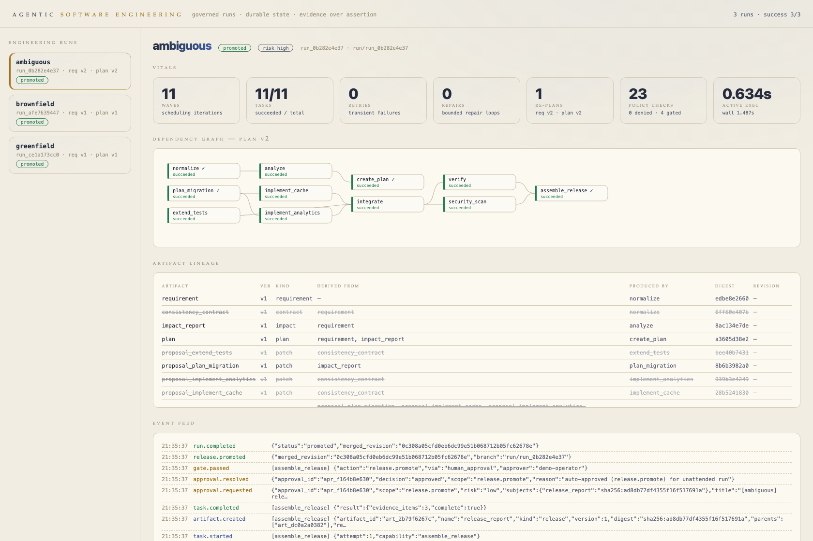
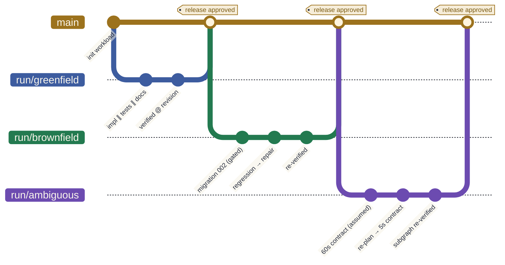

# Agentic Software Engineering System

> A policy-governed, graph-based engineering workflow that uses specialized agents to
> plan, implement, test, document, and prepare a URL-shortener change for release —
> with durable state, human gates, isolated execution, complete lineage, and recovery
> from failure or changed requirements.

The URL shortener is the **proving workload**. The system under evaluation is a
**governed, stateful software-engineering control plane** that converts requirements
into reviewable repository changes while preserving evidence, approvals, safety, and
recovery behavior.



*The Daylight Glass dashboard showing the ambiguous scenario after its mid-run
re-plan: requirement v2 / plan v2, the re-executed subgraph, stale artifacts
struck through in the lineage table, and the approved promotion in the event feed.*

## The lifecycle

```mermaid
%%{init: {"theme": "base", "themeVariables": {"background": "#F1EDE2", "primaryColor": "#FCF9F1", "primaryBorderColor": "#BFB499", "primaryTextColor": "#262C3D", "lineColor": "#8B8268", "secondaryColor": "#E9E3D3", "tertiaryColor": "#F6F1E4", "edgeLabelBackground": "#F1EDE2", "fontFamily": "ui-monospace, SF Mono, Menlo, monospace", "fontSize": "13px"}}}%%
flowchart LR
    REQ(["raw request"]) --> N["normalize<br/>requirement + facet contracts"]
    N --> AG{{"ambiguity<br/>gate"}}
    AG -->|material ambiguity| H1["human approves<br/>reversible assumptions"]
    H1 --> AN
    AG -->|clear| AN["analyze<br/>impact over existing code"]
    AN --> PL["plan<br/>dependency graph as data"]
    PL --> PG{{"plan / risk<br/>gate"}}
    PG -->|high risk| H2["human approves plan"]
    PG -->|allowed| EX
    H2 --> EX["parallel waves<br/>impl · tests · docs"]
    EX --> INT["integrate<br/>one revision, policy-checked diff"]
    INT --> V["verify<br/>evidence bound to exact revision"]
    V --> VG{{"evidence<br/>gate"}}
    VG -->|failing check| RP["bounded repair<br/>re-integrate, re-verify"]
    RP --> V
    VG -->|upstream change| SR["selective re-plan<br/>only stale descendants"]
    SR --> PL
    VG -->|budget exhausted| SS(["safe-stop<br/>worktree preserved"])
    VG -->|pass| REL["assemble release"]
    REL --> FG{{"release<br/>gate"}}
    FG -->|human approves| DONE(["promoted to main"])
    FG -->|rejected| DENIED(["denied, with reason"])

    classDef work fill:#FCF9F1,stroke:#C9BFA6,color:#262C3D
    classDef gate fill:#F6EDD9,stroke:#9C721D,stroke-width:2px,color:#7A5A12
    classDef human fill:#9C721D,stroke:#7A5A12,color:#FAF6EC
    classDef good fill:#E3EEE7,stroke:#237A50,color:#1D5C3E
    classDef warn fill:#EFE6F2,stroke:#6C4BB0,color:#4E3583
    classDef bad fill:#F5E7E4,stroke:#B0503F,color:#8A3F31
    class REQ,N,AN,PL,EX,INT,V,RP,SR,REL work
    class AG,PG,VG,FG gate
    class H1,H2 human
    class DONE good
    class SS warn
    class DENIED bad
```



## Why this exists

Most "agentic coding" demos are a linear chain: `planner → coder → tester → done`,
where an LLM declares its own success. This system takes the opposite position:

- **Agents propose; evidence and policy decide.** An agent saying "tests pass" is
  not evidence. Checks run as real commands against an exact git revision, and
  evidence from a different revision cannot satisfy a gate.
- **The graph is data, not control flow.** Work is a durable dependency graph with
  readiness, fan-out/fan-in, conditional transitions, and selective invalidation —
  not a hard-coded pipeline.
- **Autonomy is proportional to risk.** Reading code and editing an isolated
  worktree is automatic; schema migrations, high-risk plans, ambiguous requirements
  and releases require a durable, digest-bound human approval.
- **A process restart loses nothing.** All state — runs, tasks, artifacts,
  approvals, an append-only event log — lives in SQLite. Kill the process
  mid-run and resume deterministically.

## What's in the box

| Piece | Where | What it proves |
|---|---|---|
| **Engineering control plane** | `control_plane/` | Graph orchestration, gates, approvals, policy, evidence, provenance, recovery, selective re-planning |
| **URL-shortener workload (Python)** | `shortener/` | The reference (final-state) service: FastAPI, expiry, safe destination updates, TTL cache, bounded-delay analytics, migrations |
| **URL-shortener workload (Rust)** | `shortener-rs/` | Contract parity: same routes, status codes, error envelope, and migrations in axum + rusqlite — the contract is language-agnostic |
| **Three governed scenarios** | `scenarios/` | Greenfield build → brownfield change → ambiguous optimization, all against **one evolving repository** |
| **Policy as code** | `policies/default.yaml` | Default-deny; secrets/network/protected paths denied; risk-triggered approval gates |
| **Dashboard** | `ase serve` | Live run inspection: DAG, artifact lineage, event feed, approve/reject — styled after the Orreth "Daylight Glass" light theme |
| **Dockerized environment** | `ase-env.sh` + `compose.yaml` | One script: start / stop / restart / demo / logs / clean, with persistent state volumes |
| **Assessment blueprint** | `docs/assessment/` | The original assignment deconstruction this implementation follows |

## Quickstart

### Docker (nothing but Docker required)

```bash
./ase-env.sh start        # build + start the dashboard    → http://localhost:8787
./ase-env.sh demo         # run the three governed scenarios inside the container
./ase-env.sh start --all  # also serve both workloads      → :8000 (Python), :8788 (Rust)
./ase-env.sh stop|restart|status|logs|clean
```

Run state lives in named volumes and survives `stop`/`restart`; `clean` wipes it.

### Local (Python 3.12+, [uv](https://docs.astral.sh/uv/), git)

```bash
uv sync                 # install
uv run pytest           # 116 tests: control plane, workload, scenarios
uv run ase demo         # all three scenarios end-to-end (auto-approved, ~30s)
uv run ase serve        # dashboard at http://127.0.0.1:8787
```

The demo output ends with fleet metrics and per-run engineering summaries under
`.ase/runs/<run_id>/summary.md`.

### The governed (non-auto) experience

```bash
uv run ase run scenarios/brownfield.yaml
# ⛩ approval required: plan.adopt (risk high) ...
uv run ase approve <approval_id> --approver you --reason "plan is sound"
# ... the run resumes, pauses again at the schema gate, and so on
```

Approvals are durable records bound to the **content digests** of what was
approved. If the plan changes after you approve it, the approval is stale and the
gate closes again.

### Rust workload

```bash
cd shortener-rs && cargo test        # 8 contract-parity tests
cargo run                            # serves on :8788
```

## The three scenarios (one repository)

The workload repository is created at `.ase/workload` and evolved by successive
governed runs — greenfield output becomes brownfield input, which resolves the
brief's "build from scratch" vs. "brownfield reasoning" tension temporally:



1. **Greenfield** — builds the baseline service. Proves parallel fan-out
   (impl / tests / docs in one wave), synchronization at integrate, an injected
   transient failure retried within budget, and the final release gate.
2. **Brownfield** — adds link expiry + authorized destination updates. Proves
   impact analysis, a high-risk plan gate, a durable **schema-migration approval**,
   and a *genuine* failing regression: the seeded implementation carries an
   expiry-boundary defect (`<` instead of `<=`) that the new boundary test
   catches; the engine schedules a **bounded repair**, re-integrates, re-verifies.
3. **Ambiguous** — "make popular links faster without losing analytics." Proves
   ambiguity as a first-class state (proposed reversible assumptions pause for
   approval as a versioned **consistency contract**), then a scripted evaluator
   revision tightens analytics visibility from 60s to 5s mid-run: only the
   contract's descendants are invalidated, the migration and its approval
   survive, a new plan version executes, and re-approval is demanded.

Every claim above is asserted by `tests/scenarios/test_three_runs.py`.

## Failure behavior is four different things

| Control | Trigger | Behavior |
|---|---|---|
| **Retry** | Transient failure | Backoff within a per-task attempt budget |
| **Repair** | Deterministic failure (failing check) | Bounded repair task + re-integration + re-verification — never a blind re-run |
| **Fallback** | Policy denial | Route to a declared allowed alternative |
| **Safe-stop** | Budget exhaustion / no path | Cease side effects, preserve the worktree, write `RECOVERY.md`, keep all evidence inspectable |

Rollback is a real git operation (worktree reset to a known revision, recorded in
the audit trail); workload `main` is only ever touched by an approved promotion.

## LLM support (optional, off by default)

Everything above runs deterministically in mock mode — that's what makes the
orchestration testable in CI. With `ANTHROPIC_API_KEY` or `OPENAI_API_KEY` in
`.env`, `--mode live` routes the requirement analyst and planner through a
provider-neutral httpx adapter (no SDK dependencies):

- structured output is schema-validated with exactly **one** constrained repair
  attempt before escalating;
- the planner is **bounded**: it may order and connect only the scenario's action
  palette — it cannot invent capabilities, seeds, commands, or parameters;
- keys are never logged and are stripped from every subprocess the evidence
  runner spawns.

`uv run ase agents-smoke` sanity-checks your credentials.

## Repository layout

```
control_plane/          the system under evaluation
  engine.py             wave scheduler: gates, retries, repairs, safe-stop, recovery
  models.py store.py    typed records + durable SQLite state (append-only events)
  graph.py replan.py    DAG semantics + selective invalidation
  policy.py approvals.py evidence.py workspace.py artifacts.py
  agents/               provider-neutral LLM adapter + bounded role agents
  api.py static/        dashboard (Daylight Glass)
  cli.py                the `ase` command
shortener/              Python workload — reference (final-state) implementation
shortener-rs/           Rust workload — same contract, axum + rusqlite
scenarios/              three scenario specs + versioned seeds (v1 → v2 → v3)
policies/               policy-as-code (default deny)
tests/                  116 tests across control plane, workload, scenarios
docs/                   architecture, decisions (ADRs), operations, evaluation
docs/assessment/        the original blueprint this implements
Dockerfile compose.yaml ase-env.sh    the containerized environment
```

## Documentation

- [Architecture](docs/architecture.md) — components, state model, gates, provenance
- [Decisions](docs/decisions/) — ADRs with rationale and trade-offs
- [Operations](docs/operations.md) — CLI reference, state layout, recovery
- [Evaluation](docs/evaluation.md) — requirement→evidence traceability matrix,
  metric definitions, demo script, honest limitations

## Value in context

This repository is a working answer to a question most agentic-tooling projects
skip: *"Would we trust this system to participate in real software delivery
without surrendering human control?"* It is deliberately assurance-first — the
smallest credible workload, with the majority of the effort in durable state,
permission boundaries, objective evidence, human authority, and replayable
demonstrations. Use it as a reference architecture for governed agent execution,
as a harness for experimenting with LLM engineering agents behind real gates, or
as the seed of a production control plane.
