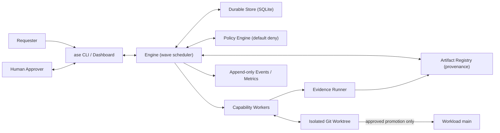

# Architecture

The system is two products in one repository: an **engineering control plane**
(the system under evaluation) and a **URL-shortener workload** (the proving
ground). The control plane never hard-codes the workload; it operates on a
separate git repository (`.ase/workload`) through policy-checked seams.

## System context

## Control-plane modules

| Module | File | Responsibility |
|---|---|---|
| Models | `models.py` | Typed records: Run, Task, Artifact, Approval, PolicyRecord, Event. Content digests (`digest_of`) bind approvals and evidence to exact content. |
| Store | `store.py` | SQLite persistence; WAL; connection-per-operation; events are append-only and never overwritten. |
| Graph | `graph.py` | Cycle/unknown-dep validation (Kahn), ready-wave computation, descendant traversal. |
| Engine | `engine.py` | The orchestrator: executes ready tasks in parallel waves, evaluates gates, pauses on approvals, classifies failures, materializes plans, applies revisions, recovers from restarts. |
| Workers | `workers.py` | Bounded capabilities (normalize, analyze, plan, apply_seed, integrate, run_checks, security_scan, assemble_release). Mock mode is deterministic; live mode routes through role agents behind the same contracts. |
| Policy | `policy.py` + `policies/default.yaml` | First-match rules → allow / deny / approval_required, with risk thresholds and numeric conditions. Every evaluation is persisted. |
| Approvals | `approvals.py` | Durable, scoped, digest-bound approvals. Staleness is checked at resolution AND at consumption. |
| Artifacts | `artifacts.py` | Versioned artifacts with parent edges (provenance DAG); selective invalidation marks only transitive descendants stale. |
| Workspace | `workspace.py` | Git worktree per run on branch `run/<id>`; policy-checked writes; diff stats; rollback; promotion only after release approval. |
| Evidence | `evidence.py` | Runs real commands in the worktree with a credential-stripped environment; records exit code, duration, output digest, and the exact revision. |
| Re-planner | `replan.py` | Publishes the revised contract, invalidates provenance descendants, resets affected tasks, produces plan v+1, demands renewed approval. |
| Telemetry | `telemetry.py` | Metrics with explicit numerator/denominator/clock definitions. |

## The run lifecycle

A run starts with three bootstrap tasks — `normalize → analyze → create_plan` —
and grows dynamically:

1. **normalize** publishes the `requirement` artifact (plus any requirement-facet
   **contracts**, e.g. `consistency_contract`). Material ambiguity attaches an
   `assumption.adopt` gate to the task: the run pauses until a human approves the
   proposed reversible defaults.
2. **create_plan** publishes the `plan` artifact and attaches a `plan.adopt` gate
   carrying the plan's computed risk. Policy decides: low/medium risk proceeds,
   high risk pauses.
3. Once the plan gate clears, the engine **materializes** the plan into Task
   records (idempotent upsert by name) and executes ready waves in parallel
   (ThreadPoolExecutor; wave membership is recorded in `wave.started` events).
4. Proposal tasks (`apply_seed`) only write files; **integrate** commits the
   combined proposals as one revision and submits the diff to policy
   (`change.integrate`, with a changed-lines threshold).
5. **run_checks / security_scan** produce evidence artifacts bound to the
   integrated revision.
6. **assemble_release** builds the review package and attaches the
   `release.promote` gate — the final human checkpoint. Approval promotes the
   run branch into workload `main` (merge commit recorded); rejection denies.

### Gates

A gate is `GateSpec(action, resource, subject_artifacts)` evaluated by policy
when its owning task succeeds. `approval_required` creates a durable Approval
whose `subject_digests` snapshot the named artifacts; the run status becomes
`awaiting_approval` and `tick()` returns. Approving (CLI or dashboard) and
ticking again consumes the approval — after re-verifying the digests.

### Failure classification

Workers raise typed exceptions; the engine routes by class:

| Class | Source | Route |
|---|---|---|
| `TransientFailure` | timeouts, provider blips, injected faults | retry with backoff while `attempts < max_attempts`, else safe-stop |
| `DeterministicFailure` | failing required check, bad seed | scheduled repair (`repair_N` + `reintegrate_N` prepended to the failed task's deps) within `max_repairs`, else safe-stop |
| `PolicyDenied` | forbidden write/command | declared fallback if present, else safe-stop |
| `InvalidOutput` | schema-violating agent output | one constrained repair via the retry path |

Safe-stop preserves the worktree, writes `RECOVERY.md`, and never touches
workload `main`. Rollback (`workspace.rollback`) is a distinct, recorded
operation restoring a known revision.

### Restart recovery

Every state change commits at write time. On `tick()`, tasks found `RUNNING`
(i.e., the process died mid-task) are re-queued with their attempt refunded and
a `task.recovered` event. Scenario tests kill and rebuild the entire object
graph between approval and resume.

## Provenance and selective re-planning

Artifacts carry parent edges — `requirement → impact_report → plan`,
`consistency_contract → proposal_implement_analytics → change_set → evidence_*`.
When a revision republishes a contract:

1. old versions of the contract become stale; provenance descendants are marked
   stale transitively;
2. tasks that produced stale artifacts — plus their task-graph descendants —
   reset to pending under plan v+1;
3. tasks and artifacts derived only from unchanged inputs keep their status and
   versions (asserted: the schema migration task and its approval survive the
   ambiguous scenario's revision untouched);
4. a pending approval whose subjects changed is marked stale and the gate
   re-opens; the revision itself demands renewed approval bound to the new
   digests.

## Workload architecture (Python reference)

`domain.py` (validation, code allocation, inclusive expiry) → `persistence.py`
(SQLite system of record; migrations tracked in `schema_migrations`; optimistic
concurrency; audit rows) → `analytics.py` (in-memory buffer, batched flush,
bounded visibility, fail-open) → `cache.py` (TTL/LRU; DB stays source of truth;
expiry re-evaluated per request so a cached entry cannot outlive its link) →
`api.py` (contract surface + error envelope) → `observability.py` (request IDs,
structured logs).

The Rust implementation (`shortener-rs/`) embeds the same migration files at
compile time and mirrors the contract 1:1; its divergences (synchronous
analytics, no cache layer) are stated in its stats `consistency` field and
README rather than hidden.

## Security posture

- Default-deny policy; secrets and external network are denied to workers
  outright; `policies/*` and `.git/*` are write-protected; the run cannot
  weaken its own policy.
- The evidence runner strips credential-shaped variables (`*KEY*`, `*TOKEN*`,
  `*SECRET*`, …) from every subprocess environment — proven by a test that
  plants a fake key and asserts the checked command cannot see it.
- Repository content is treated as untrusted data; the security scan flags
  credential literals and dangerous constructs in the integrated change.
- The bounded planner strips LLM-proposed actions/params that are not in the
  scenario's palette (tested with a malicious plan).
