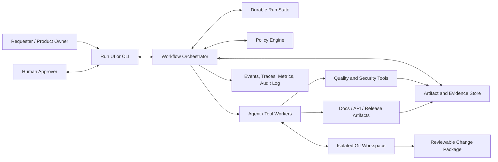
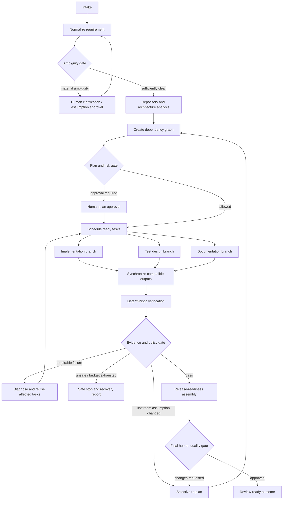

# 03 — Reference Architecture and Orchestration

## Architecture objective

The design should make good behavior the default: agents cannot advance the lifecycle by assertion, risky side effects require authority, evidence is tied to an exact revision, and a changed upstream decision invalidates only affected downstream work.

## System context



## Recommended implementation shape

For a prototype, prefer a **modular monolith control plane** with durable adapters rather than microservices. It is easier to run, inspect and demonstrate while retaining clean seams for later distribution.

### Control-plane modules

| Module | Responsibility |
|---|---|
| Intake | Receive a request, repository reference and constraints |
| Requirement normalizer | Produce goals, non-goals, acceptance criteria, ambiguity and risk hints |
| Repository analyzer | Build a bounded impact map and retrieve only relevant code/context |
| Planner | Produce a dependency graph with task contracts and exit criteria |
| Scheduler/orchestrator | Select ready tasks, fan out safe work, synchronize results, route failures |
| Worker registry | Resolve task capability to a bounded agent/tool implementation |
| Workspace manager | Create isolated branch/worktree, enforce paths, calculate diffs and restore checkpoints |
| Evidence runner | Execute tests, type/lint/contract/security checks and capture immutable results |
| Policy engine | Decide allow, deny or approval-required for actions and transitions |
| Approval service | Persist scoped requests and resume paused runs |
| Artifact registry | Store versioned artifacts, digests, provenance and relationships |
| Re-planner | Calculate staleness and replace affected plan subgraphs |
| Release assembler | Produce final engineering summary and review/release package |
| Telemetry | Emit structured events, distributed traces, audit records and reliability metrics |

### Target URL-shortener modules

| Module | Responsibility |
|---|---|
| API | Versioned administrative link endpoints and error model |
| Redirect | Fast code resolution and redirect response |
| Domain | Link lifecycle, validation, code allocation and policies |
| Persistence | Link repository, migrations, transactional constraints |
| Analytics ingestion | Non-blocking click event capture |
| Analytics query | Aggregated statistics with stated consistency |
| Reliability boundary | Timeouts, health/readiness, rate limiting and graceful degradation |
| Observability | Request IDs, structured logs and service metrics |

## Why a graph, not a chain

A chain encodes order. A graph encodes **readiness, dependency, concurrency, invalidation and recovery**. The plan graph should be data, not hard-coded control flow.



The three parallel boxes do not imply that implementation, tests and documentation blindly edit the same files concurrently. They can generate proposals or operate on isolated patches; the orchestrator integrates compatible results at synchronization points.

## Authoritative run state

Use one typed state record per run. An illustrative schema:

```yaml
run:
  id: run_01
  status: executing
  base_revision: abc123
  current_revision: def456
  requirement_version: 3
  plan_version: 2
  risk_level: high
  budgets:
    max_steps: 40
    max_replans: 3
    max_attempts_per_task: 2
    max_elapsed_minutes: 30
  pending_approval: null
  tasks:
    implement_create_api:
      status: succeeded
      depends_on: [approve_api_contract]
      input_digests: [req_v3, design_v2]
      output_artifacts: [patch_17]
      attempts: 1
  evidence: [unit_21, contract_08, security_04]
  decisions: [adr_03, assumption_06]
  stale_artifacts: []
```

The workflow history is append-only. Current state may be materialized for fast scheduling, but audit records should not be overwritten.

## Task contract

Every task should declare:

- stable task ID and plan version;
- objective and non-goals;
- prerequisites;
- input artifact IDs/digests;
- output schema;
- allowed tools, paths and side effects;
- risk classification;
- completion evidence;
- retry class and maximum attempts;
- timeout/resource budget;
- fallback and escalation route.

This prevents the planner from issuing vague tasks such as “make it production ready.”

## Artifact lineage and selective invalidation

Artifacts form a provenance graph:

```text
requirement:v3
  └─ design:v2
      ├─ api-contract:v2
      │   ├─ implementation-patch:17
      │   └─ contract-tests:8
      └─ risk-register:v2
          └─ security-evidence:4
```

If `api-contract:v2` changes, its descendants become stale. Unrelated documentation or infrastructure evidence derived only from unchanged inputs can remain valid. The re-planner:

1. persists the new upstream version;
2. traverses provenance edges to mark descendants stale;
3. recomputes affected tasks and dependencies;
4. recalculates risk;
5. invalidates approvals tied to changed digests;
6. resumes only after any new gate is satisfied.

## Entry and exit gates

| Stage | Entry gate | Exit gate |
|---|---|---|
| Normalize | Request exists; repository scope known | Goals, constraints, acceptance criteria and ambiguity classified |
| Analyze | Requirement is sufficiently clear or assumption approved | Impact map and architecture risks complete |
| Plan | Normalized requirement and impact report valid | DAG is acyclic, tasks are bounded, acceptance criteria have coverage |
| Execute | Plan/policy approval valid; workspace isolated | Expected artifacts exist and task contracts pass schema validation |
| Verify | Integrated revision fixed and reproducible | Required deterministic checks pass on that exact revision |
| Release-ready | Evidence complete; residual risks classified | Summary, rollback notes and human final decision recorded |

## Agent roles and autonomy boundaries

| Role | May do | May not do by default |
|---|---|---|
| Requirement analyst | Structure request, identify ambiguity, propose acceptance criteria | Invent material business rules silently |
| Architecture analyst | Read repository, trace dependencies/data flow, propose design | Modify code or approve own proposal |
| Planner | Create task graph and budgets | Execute tasks or bypass policy |
| Implementer | Edit allowed files in isolated workspace, run scoped checks | Access secrets, deploy, merge, weaken policy |
| Test verifier | Add tests, run checks, report evidence | Convert a failing check to pass by deleting coverage without review |
| Security reviewer | Run scans and review threat surfaces | Grant its own policy exception |
| Docs/release agent | Update docs, compose release package | Declare release approval |
| Orchestrator | Schedule, persist, route, invalidate and enforce gates | Substitute its opinion for missing evidence or approval |

For higher-risk changes, enforce proposer/reviewer separation. This can be logical separation in the prototype, but the audit trail must show distinct roles and outputs.

## Failure taxonomy and control behavior

| Failure class | Example | Correct response |
|---|---|---|
| Transient tool failure | Process timeout, temporary model/provider error | Retry with backoff within attempt budget |
| Deterministic validation failure | Unit test or type check fails | Diagnose and create repair task; do not repeat unchanged action |
| Invalid structured output | Agent result violates schema | One constrained repair attempt, then fallback/escalate |
| Requirement ambiguity | Retention period unknown | Ask human or propose reversible assumption through approval gate |
| Policy denial | Agent requests secret or protected-branch write | Deny; optionally re-plan to an allowed approach |
| Integration conflict | Parallel patches touch incompatible lines/contracts | Serialize integration, reconcile explicitly, re-run affected evidence |
| Budget exhaustion | Repeated repair loops | Safe-stop with workspace preserved and recovery instructions |
| Upstream change | Acceptance criterion revised | Selectively invalidate, re-plan and renew affected approval |
| Dangerous side effect | Destructive migration requested | Require critical approval or stop; generate safe alternative |

## Retry, fallback, rollback, and safe-stop are different

- **Retry:** repeat a transient operation without changing the intended approach.
- **Fallback:** choose an alternate bounded implementation or tool after a classified failure.
- **Rollback:** restore code/workflow/deployment/data to a known good state after a change.
- **Safe-stop:** stop taking side effects, persist state/evidence, clean or quarantine active execution, and explain how a human can resume.

The demo should show at least one of each as an executable transition or a focused automated test. They should not be four labels pointing to the same generic error handler.

## Policy model

Represent policy decisions as code and data:

```yaml
decision: approval_required
policy_version: 7
action: database_migration
subject: implementer
resource: migrations/004_add_expiry.sql
reasons:
  - schema_change
  - rollback_plan_required
required_evidence:
  - migration_test
  - backward_compatibility_review
  - rollback_instructions
```

Minimum policies:

- allowed repository roots and file types;
- command and network policy;
- secret/credential denial;
- dependency allow/deny and vulnerability threshold;
- maximum diff/risk thresholds;
- protected files and branches;
- test/security evidence required by change type;
- approval requirements;
- no policy weakening by the same run without external approval.

## Observability and auditability

Emit structured events such as:

- `run.created`, `requirement.versioned`, `ambiguity.detected`;
- `plan.created`, `task.ready`, `task.started`, `task.completed`, `task.failed`;
- `policy.evaluated`, `approval.requested`, `approval.resolved`;
- `artifact.created`, `artifact.invalidated`;
- `retry.scheduled`, `fallback.selected`, `rollback.executed`, `run.safe_stopped`;
- `evidence.recorded`, `release.ready`, `run.completed`.

Each event should include run/task IDs, trace/span IDs, actor, action, timestamps, input/output digests, revision, policy version and outcome. Redact secrets and sensitive requirement content from logs.

Core metrics:

- run success rate, by scenario/change class;
- first-pass verification rate;
- task and run retry frequency;
- rollback and safe-stop frequency;
- human intervention count and wait time;
- mean time to recover/repair (define the clock precisely);
- end-to-end active latency and wall-clock latency;
- re-plan count and invalidated-work ratio;
- evidence completeness and policy-denial rate;
- cost/token/tool-call budget if LLM economics matter.

With only three demo runs, treat metrics as instrument validation and illustrative measurements, not statistically significant reliability claims.

## Technology recommendation

A pragmatic default is:

- Python control plane with a graph/state-machine orchestration library or a small explicit graph engine;
- durable SQL state (SQLite for zero-friction demo, PostgreSQL profile for realistic concurrency);
- typed validation models;
- policy-as-code adapter;
- Git worktree or disposable checkout per run;
- containerized command runner with resource limits;
- OpenTelemetry-compatible traces plus structured logs;
- FastAPI URL-shortener service;
- PostgreSQL for link mappings and durable analytics events;
- optional Redis for rate limiting/caching, with a documented degraded mode;
- OpenAPI, database migrations, unit/integration/contract/security tests;
- provider-neutral LLM adapter and deterministic test doubles.

Do not let framework choice become the architecture. The durable run model, graph semantics, gates, permissions, evidence and recovery behavior are the design.

## Minimal versus stretch scope

### Minimum compelling prototype

- real repository edits in isolation;
- persisted graph and resume;
- three scenarios;
- parallel planning/test/document work with a synchronization gate;
- at least two human checkpoints;
- deterministic verification;
- one retry, one re-plan and one safe-stop demonstration;
- policy deny/approval decision;
- review-ready output and metrics page/report.

### Stretch capabilities

- pull-request integration;
- signed provenance/attestations;
- semantic code graph;
- distributed workers;
- live deployment with canary/rollback;
- multi-model routing;
- evaluator benchmark suite;
- web dashboard.

Stretch items should never displace the minimum orchestration proof.

