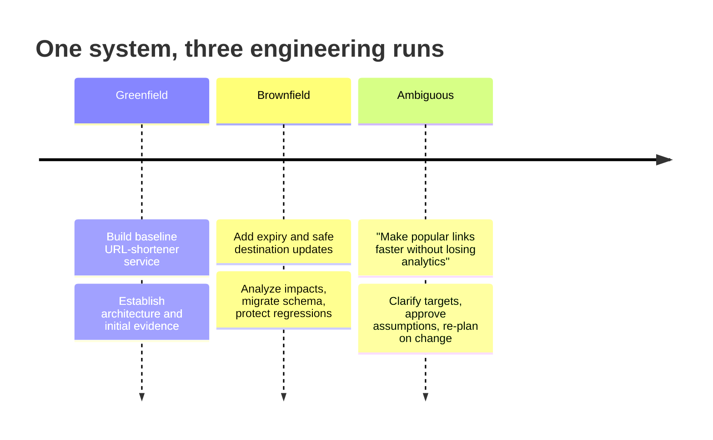
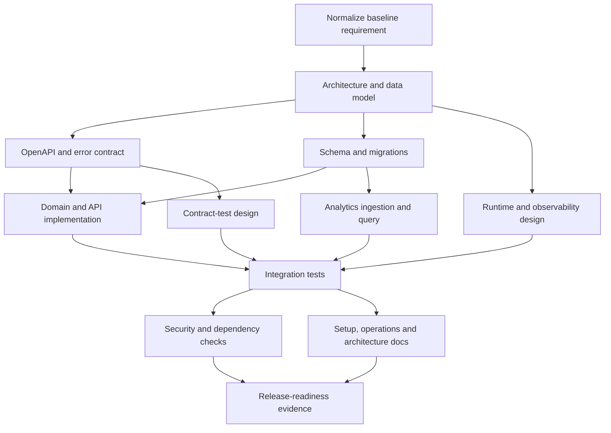
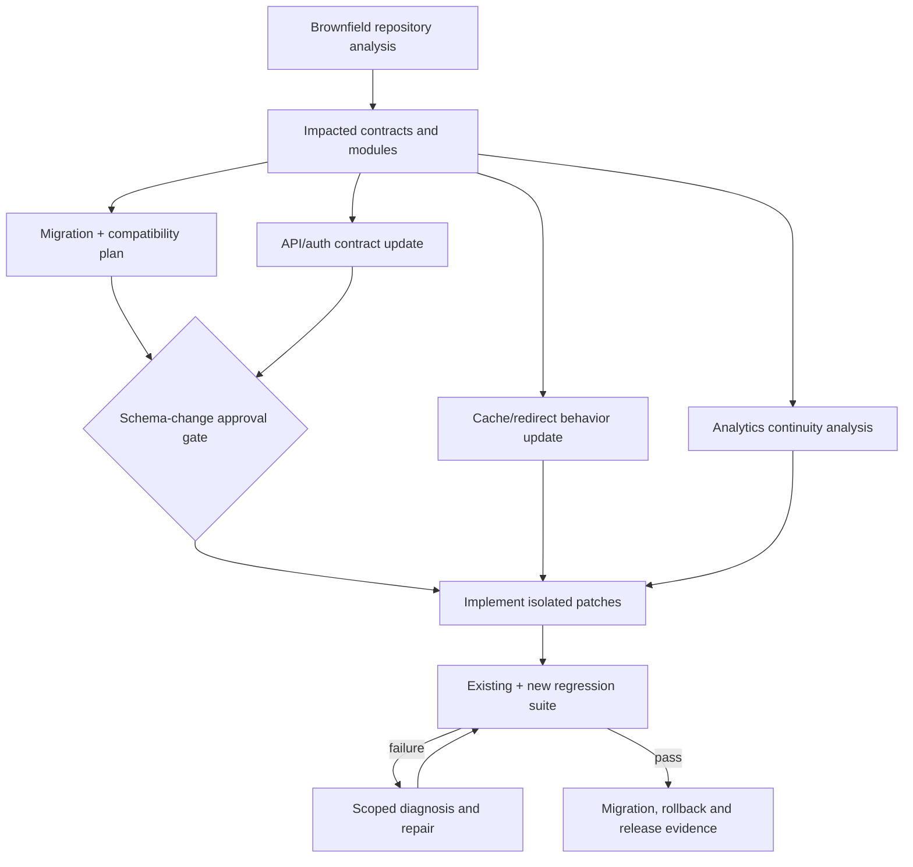

# 04 — Scenarios and Delivery Plan

## Scenario strategy

Use one repository and a sequence of governed runs. Preserve run histories, requirement versions, plan versions, code revisions, approvals and evidence so the evaluator can trace how the system evolves.



## Scenario 1 — Greenfield baseline

### Input requirement

> Build a URL-shortener service that creates short links, redirects visitors, exposes basic click analytics, and is locally runnable and testable.

### Normalized requirement

**Goals**

- Create an opaque short code for a valid HTTP(S) destination.
- Resolve the code to a temporary redirect.
- Expose link metadata and eventually consistent click totals.
- Provide stable API and error contracts.
- Provide health behavior, migration, tests, documentation and local setup.

**Non-goals**

- Custom domains, billing, multi-region replication and production deployment.
- Personally identifiable click tracking.
- User-facing web interface.

**Representative acceptance criteria**

1. A valid create request returns a unique code and canonical short URL.
2. Repeating a request with the same idempotency key does not create a second mapping.
3. An existing code redirects; unknown or disabled codes return the documented status.
4. Redirect processing records an analytics event without making the redirect depend on aggregate computation.
5. Concurrent create operations cannot map the same code to different destinations.
6. OpenAPI, migrations, unit tests, integration tests and setup documentation are present.
7. Required quality and security checks pass on the exact output revision.

### Decomposition graph



### Orchestration proof

- API contract, database design and operational design can fan out after architecture agreement.
- Test design begins from the contract before implementation is complete.
- Integration waits at a synchronization gate for schema, code and test artifacts.
- A failing collision-concurrency test creates a bounded repair task rather than restarting the run.
- Final human review is bound to the output revision and evidence bundle.

### Expected output

- service source and configuration;
- OpenAPI definition;
- database migrations;
- automated checks;
- architecture and operations documentation;
- threat/risk notes;
- run graph, events, metrics and final engineering summary.

## Scenario 2 — Brownfield change

### Input requirement

> Add optional link expiration and allow an authorized operator to update a link’s destination without breaking analytics.

This is a good brownfield case because it affects persistence, API semantics, cache behavior, redirect correctness, authorization, analytics identity, documentation and rollback.

### Impact analysis expectations

The architecture analyst should identify at least:

- link table/entity and migration path;
- create/get/update API schemas;
- redirect lookup and cache invalidation;
- distinction between stable link identity and mutable destination;
- analytics aggregation key;
- expired-link status and error contract;
- authorization boundary for updates;
- clock handling and time-based tests;
- compatibility with existing links and clients;
- deployment order and rollback limits.

### Key design decisions to surface

1. **Expiration semantics:** store an absolute UTC timestamp; existing links default to no expiry.
2. **Expired response:** choose and document a stable status rather than silently behaving as not-found.
3. **Analytics continuity:** aggregate against immutable link identity, not destination URL.
4. **Update safety:** authenticated administrative operation, optimistic concurrency/version field, audit event.
5. **Caching:** invalidate code lookup after update; cache entries must not outlive expiry.
6. **Migration:** additive nullable columns first, backward-compatible code, explicit rollback constraints.

### Decomposition and synchronization



### Validation focus

- old links still resolve after migration;
- expiry boundaries use a controlled clock and timezone-safe comparisons;
- update does not reset or split analytics;
- unauthorized update fails;
- lost-update race is prevented;
- cache invalidation is tested;
- OpenAPI compatibility changes are classified;
- migration runs both from empty and populated baseline databases;
- rollback documentation states whether post-migration writes constrain downgrade.

### Orchestration proof

- The system reasons about existing code rather than regenerating the service.
- A schema-changing plan triggers a human gate.
- Existing evidence is reused only when inputs remain unchanged.
- Regression checks run on the integrated revision.
- A repair loop is bounded and recorded.

## Scenario 3 — Ambiguous optimization

### Input requirement

> Make popular links faster without losing analytics.

This is intentionally underspecified. “Popular,” “faster,” and “without losing” lack measurable meaning. The request also creates a consistency trade-off: aggressive caching can bypass or delay analytics.

### Ambiguities to identify

- What traffic level or popularity threshold applies?
- What baseline and target latency percentile define “faster”?
- Is eventual analytics acceptable, and what delay/loss budget is permitted?
- May infrastructure such as Redis be added?
- Does the target destination change frequently?
- What behavior is required when the cache or event sink is unavailable?
- Are per-link exact counts required, or are bounded approximations acceptable?
- What cost and operational limits apply?

### Controlled handling

The requirement analyst should assign high materiality to latency and analytics-consistency ambiguity. It may propose an explicit, reversible default:

- target p95 redirect latency under a stated local workload;
- cache hot code-to-destination mappings;
- preserve the database as source of truth;
- enqueue an analytics event on every redirect;
- allow bounded aggregation delay but no acknowledged-event loss in the test envelope;
- fail open for redirects if analytics ingestion is temporarily unhealthy, while emitting a loss-risk metric;
- add Redis only behind an adapter, with a database-only fallback.

The human approves, edits or rejects these assumptions. Approval creates requirement version 2.

### Dynamic re-plan demonstration

After the initial plan is created, simulate or accept an upstream change:

> The evaluator changes the analytics requirement from “up to 60 seconds delayed” to “visible within 5 seconds.”

The system should:

1. persist requirement version 3;
2. mark latency/analytics design and derived tasks stale;
3. retain unaffected URL validation and authorization evidence;
4. re-plan ingestion, aggregation and performance-test tasks;
5. recalculate infrastructure and reliability risks;
6. invalidate approval tied to the prior consistency contract;
7. request renewed approval if cost or failure behavior changed;
8. execute and verify the new subgraph.

### Validation focus

- controlled cold- and hot-cache load tests;
- correctness under cache miss, stale entry and Redis outage;
- destination updates invalidate cached values;
- expiry is honored even for cached entries;
- analytics event accounting under concurrency and worker restart;
- visible aggregation delay measured against the new target;
- no unsupported claim of “zero loss” beyond the defined fault model.

### Orchestration proof

- ambiguity is a first-class state, not quietly filled in by a model;
- human input changes structured upstream state;
- selective invalidation and re-planning work;
- the graph branches based on policy and evidence;
- reliability trade-offs remain visible in the final summary.

## Recommended repository layout

```text
repository/
├── control_plane/
│   ├── api/
│   ├── orchestration/
│   ├── agents/
│   ├── artifacts/
│   ├── policy/
│   ├── workspace/
│   ├── evidence/
│   └── telemetry/
├── shortener/
│   ├── api/
│   ├── domain/
│   ├── persistence/
│   ├── analytics/
│   └── observability/
├── migrations/
├── contracts/
├── policies/
├── scenarios/
│   ├── greenfield/
│   ├── brownfield/
│   └── ambiguous/
├── tests/
│   ├── control_plane/
│   ├── shortener/
│   ├── integration/
│   ├── scenarios/
│   └── failure_injection/
├── docs/
│   ├── architecture/
│   ├── decisions/
│   ├── operations/
│   └── runs/
└── compose.yaml
```

The exact folders may vary, but control-plane code, target-service code, scenario fixtures, policy, evidence tests and documentation should be visibly distinct.

## Incremental delivery plan

### Phase 0 — Freeze the proof strategy

**Outcome:** an agreed scope and traceability baseline.

- adopt/adjust the assumptions;
- choose implementation stack and provider mode;
- define the three scenario inputs and acceptance criteria;
- create a requirement-to-evidence matrix;
- define demo time and resource budgets.

**Exit gate:** every critical assignment requirement maps to planned executable evidence.

### Phase 1 — Build the deterministic skeleton

**Outcome:** a durable workflow can run without an LLM.

- typed run/task/artifact/approval/evidence models;
- persisted state and append-only events;
- graph validation and ready-task scheduler;
- policy decisions and approval pause/resume;
- workspace isolation;
- deterministic fake workers.

**Why first:** it proves orchestration behavior independently of model variability and makes later tests stable.

**Exit gate:** automated tests demonstrate fan-out/fan-in, pause/resume, retry budget, safe-stop and state recovery after process restart.

### Phase 2 — Add repository execution and evidence

**Outcome:** tasks create real, contained changes.

- repository analyzer and change-impact artifact;
- controlled command runner;
- patch integration and revision binding;
- unit/type/lint/security/contract check adapters;
- artifact provenance and digests;
- final evidence bundle.

**Exit gate:** a fixture repository can be modified and verified without escaping allowed paths or bypassing policy.

### Phase 3 — Add bounded agent capabilities

**Outcome:** agents produce structured plans and changes through stable contracts.

- provider-neutral model adapter;
- role prompts/context assembly;
- structured output validation and repair;
- code/test/document workers;
- token, step and elapsed-time budgets;
- deterministic mock mode for CI.

**Exit gate:** the same scenario succeeds with live-agent mode and remains fully testable in mock mode.

### Phase 4 — Execute the greenfield scenario

**Outcome:** baseline URL-shortener is review-ready.

- generate architecture, contract and plan;
- implement service and database behavior;
- execute verification and policy gates;
- collect metrics and final summary;
- commit/tag the scenario baseline.

**Exit gate:** baseline acceptance criteria and assignment evidence matrix pass.

### Phase 5 — Execute brownfield and ambiguous scenarios

**Outcome:** the differentiating behavior is proven.

- run impact analysis against the baseline;
- demonstrate schema approval, regression protection and repair loop;
- introduce the ambiguous performance request;
- capture clarification/assumption approval;
- alter an upstream target and demonstrate selective re-planning.

**Exit gate:** all three histories can be replayed or inspected with complete lineage.

### Phase 6 — Harden, rehearse and package

**Outcome:** a reviewer can reproduce and understand the result.

- one-command local setup and scenario runners;
- clean-start verification;
- fault-injection tests;
- secrets/dependency/license/security scans;
- architecture decisions, limitations and rollback notes;
- seeded demo mode to reduce provider variability;
- concise live-demo script and pre-generated fallback evidence.

**Exit gate:** a new reviewer can follow the README, run the system and trace an output to its requirement and evidence.

## Prioritization if time is constrained

Protect these first:

1. durable graph and state transitions;
2. real repository change and deterministic evidence;
3. risk-based approvals and policy enforcement;
4. failure/recovery and re-plan demonstrations;
5. three coherent scenarios;
6. review-ready final package.

Reduce these before compromising the core:

- dashboard polish;
- cloud deployment;
- Redis if the adapter/failure story can be proven with a local substitute;
- many model providers;
- broad URL-shortener features;
- distributed control-plane services.

## Recommended team ownership model

Even for a solo assignment, describe responsibility as if the system had owners:

| Area | Accountable role |
|---|---|
| Requirement and scenario truth | Product/system analyst |
| Orchestration state and recovery | Control-plane engineer |
| Policy and execution sandbox | Security/platform engineer |
| URL-shortener architecture | Service engineer |
| Verification and fault injection | Quality/reliability engineer |
| Documentation and demo evidence | Release owner |

This highlights separation of concerns without pretending that autonomous agents replace human accountability.

